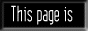

# Hi, my name is Lúcio And i make things

## Languages:
| | |
| ----------- | ------------ |
|  | Medium-Advanced Knowledge (according to myself lol) |
|  | Scary but i can build things with it |
|  | Do you ever truly get good at C? Probably medium knowledge too |
|  | Experimenting with |
|  | Really sweet. Built a discord bot with it once |

## Front end
- I know vanilla html and css
- Not really a fan of... any front end framework for that matter

## Here is some stalking information:
| Stalking | *Info!!* |
| -------- | -------- |
| I use Neovim |  |
| I live in Brazil | |
| I'm a linux chad that uses Arch |  |
| I'm an furry!!!! ... | ... And it's *miserable*! |

## I want to collaborate with you:
Nooo don't collaborate with me i'm disgusting...

---
</img>
